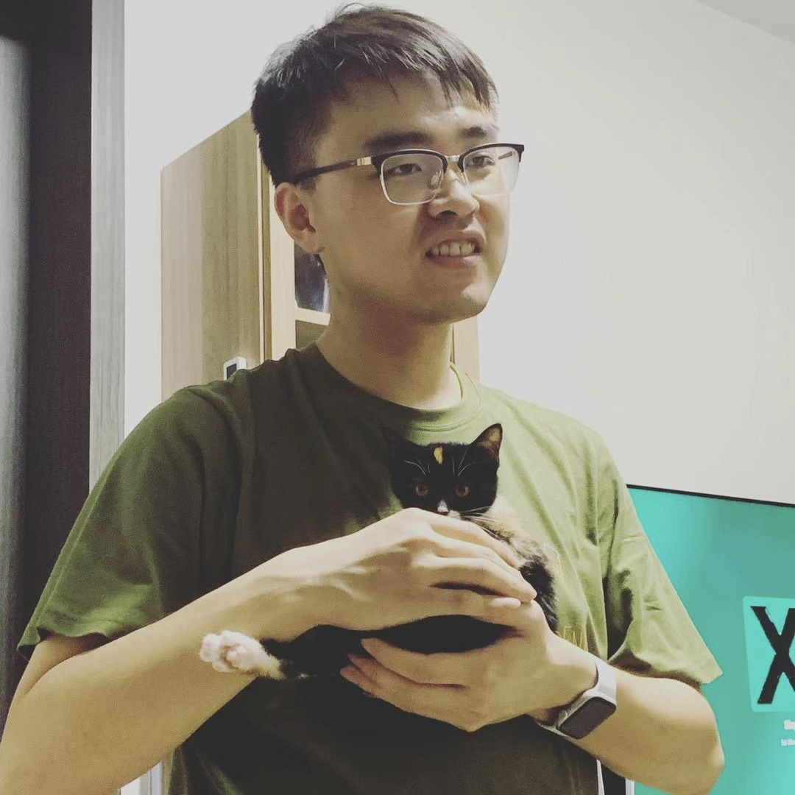

## Yisong Miao's Academic Homepage

# About {#about}

Aloha 👋 You have reached my academic homepage. 

I am a fourth year PhD student at [WING](https://wing.comp.nus.edu.sg/)-[SoC](https://comp.nus.edu.sg/)-[NUS](https://nus.edu.sg/). I study natural language processing with [Prof Min-Yen Kan](https://www.comp.nus.edu.sg/~kanmy). 

**Physical Yisong:** AS6 Building, meet me in the lab :P  **Digital Yisong:** [[Google Scholar](
https://scholar.google.com/citations?hl=en&user=a-oIKBoAAAAJ&view_op=list_works&sortby=pubdate)]  [[LinkedIn](https://www.linkedin.com/in/yisongmiao/)]  [[GitHub](https://github.com/YisongMiao/)] [[Twitter](https://twitter.com/yisongmiao)]  [[Skype](live:miaoyisong)]  **Email Yisong:** [yisong domain-of comp.nus.edu.sg]; [miaoyisong domain-of gmail.com]. 

# Research {#papers}
## Overview

I ❤️ 🆑. 

I study how language models interpret meanings, relationships, and structures in linguistic elements like discourse and emojis. 
My work involves developing new datasets, evaluation methods, and inference algorithms to advance understanding.

## Papers
I only list my **🔝 3️⃣ 📜** here ([Complete list](publications) is also available):

[📜1] A new paper about discourse semantics.  
[📜2]  <u>Yisong Miao</u> , Hongfu Liu, Wenqiang Lei, Nancy F. Chen, Min-Yen Kan (2024)  <u><i>Discursive Socratic Questioning: Evaluating the Faithfulness of Language Models’ Understanding of Discourse Relations.</i></u> **ACL 2024**. 
[[PDF](https://yisong.me/publications/acl24-DiSQ-CR.pdf)] [[Slides](https://yisong.me/publications/acl24-DiSQ-Slides.pdf)] [[Poster](https://yisong.me/publications/acl24-DiSQ-Poster.pdf)] [[The Dataset / Official Implementation](https://github.com/YisongMiao/DiSQ-Score)] ⭐️ Area Chair Award ⭐️   
[📜3] Zi Yun Yang, Ziqing Zhang, <u>Yisong Miao</u> (2024). <u><i>The ELCo Dataset: Bridging Emoji and Lexical Composition.</i></u>\* **LREC-COLING 2024**. [[PDF](https://yisong.me/publications/ELCo@LREC-COLING24.pdf)] [[Slides](https://yisong.me/publications/ELCo@LREC-COLING24-Oral.pdf)] [[Poster](https://yisong.me/publications/ELCo-Poster.pdf)] [[The Dataset / Official Implementation](https://github.com/WING-NUS/ELCo)]  

\* 📜1: Ongoing research.  
\* 📜2: I am honored and incredibly grateful to be recognized by our small yet wonderful community. 🙇‍♂️ I am motivated to discover more knowledge about discourse in/for LLMs! 
\* 📜3: Co-advised with Prof Min. He was omitted from the author list for his general chairing's COI at LREC-COLING. I re-wrote the paper with new formalizations and experiments after advisee's graduation.  

# More information {#mi}
## Favorites
My favorite singer is [Khalil Fong](https://khalilfong.com/2017/#3). His 2011 album [15](https://open.spotify.com/album/01mDyY0OcuqHnvTbEKBH0s) is my favorite.  My favorite composer is [Frédéric Chopin](https://youtu.be/UcOjKXIR8Iw?si=a60Lmo8h_NIYPAxS). I especially enjoy his [Piano Concerto No. 1](https://youtu.be/gV_x_QY1P5c?si=W4ledRy-fA_662Hu) and his [Nocturne No. 8 In D Flat, Op. 27 No. 2](https://youtu.be/vDaeVGAzgqo?si=ChjU8mvFVEFik3Xw).  My favorite driver is [Charles Leclerc](https://youtu.be/h-ce3gPMsGc?si=JC0MY-DFGm3AKzXw). He won in [Austin '24](https://youtu.be/kLCytMTycxI?si=8YLPqrirZJtg8Bf2), [Monza '24](https://www.youtube.com/watch?v=sTmpbEYUba0&pp=ygURZjEgaXRhbHkgbW9uemEgMjQ%3D), [Monte Carlo '24](https://www.youtube.com/watch?v=aeCI0ObFY8M&pp=ygUMZjEgbW9uYWNvIDI0), [Red Bull Ring '22](https://www.youtube.com/watch?v=G_8mOQeSa2U&pp=ygUPZjEgYXVzdHJpYSAyMDIy), [Albert Park '22](https://www.youtube.com/watch?v=dt8ANZIZ8Co&pp=ygURZjEgYXVzdHJhbGlhIDIwMjI%3D), [Bahrain '22](https://www.youtube.com/watch?v=wIYPuzWCCSw&pp=ygUPZjEgYmFocmFpbiAyMDIy), [Monza '19](https://www.youtube.com/watch?v=h-ce3gPMsGc&t=26s&pp=ygUNZjEgaXRhbHkgMjAxOQ%3D%3D), and [Spa '19](https://www.youtube.com/watch?v=dnnh8unDP4Y&t=182s&pp=ygUPZjEgYmVsZ2l1bSAyMDIy). 

## Recent readings
(by recency)
- *Logics in Conversation* by Nicholas Asher and Alex Lascarides
- *A History of Western Philosophy* by Bertrand Russell
- *Elon Musk* by Walter Isaacson

My [Google Calendar](#calendar) is here. Carpe Diem! 

<dev>

<iframe src="https://calendar.google.com/calendar/embed?height=600&amp;wkst=1&amp;bgcolor=%23ffffff&amp;ctz=Asia%2FManila&amp;src=ZTNvcTIwbXBqYzMyMDc4OG1zajNpZm84M3NAZ3JvdXAuY2FsZW5kYXIuZ29vZ2xlLmNvbQ&amp;color=%23039BE5" style="border:solid 1px #777" width="800" height="600" frameborder="0" scrolling="no"></iframe>

</dev>

[🔝 Go back to top](#about)

<i>------ Stay Hungry, Stay Foolish ------</i>   

