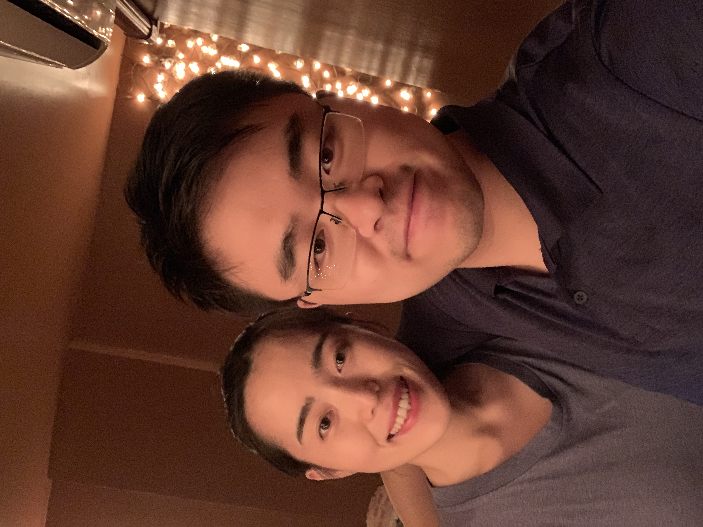

## I'm Yisong

Welcome to my personal website!

## About

I'm a second-year master student at [SoC(School of Computing)](https://www.comp.nus.edu.sg/), [NUS(National University of Singapore)](https://www.nus.edu.sg/).  
I'm affiliated to [WING (Web Information Retrieval and Natural Language Processing Group)](https://www.wing.nus.edu.sg/)  
I'm fortunate to be advised by [Prof Min-Yen Kan](https://www.comp.nus.edu.sg/~kanmy) and [Dr. Wenqiang Lei](https://sites.google.com/view/wenqianghome/home)

## Research Interest

> *"At the end of day, I don't care what other people do, I care how you understand you work."* -- What Prof Min and Wenqiang insist on our research style.

### Conversational AI

- Conversational Recommendation.
  Project webpage: [here](http://wing.comp.nus.edu.sg/?page_id=1039)  

### Discourse and Lexical Semantics

- Contextual Lexical Relation  
- Implicit Discourse Relation Recognition.  

## Publications

Coming Soon.

## Education

> I never let school interfere with my education. -- Mark Twain

2014-2018, Bachelor of Engineering in Computer Science 
**Founding Class** of undergrad program of [University of Chinese Academy of Sciences](https://english.ucas.ac.cn/).

2018-2020, Master of Computing, National University of Singapore.

## URL Link to my friends

> *When Voldmolt is after you, you'd better be with your friends*. -- What Yisong learns from Harry Potter

- [Ms. Xin Wang](wangxinalice.com) is not only my girlfriend, but also my best friend. She is now an investment associate with [Prosperity Investment](http://www.cgpinvestment.com) based in Beijing, sha has broad interest in the AI industry and AI-enpowered traditional industry. She earned dual degree in Bachelor of Law and English Literature from [UIBE](http://www.uibe.edu.cn) in 2017. We are in love since August 2015.  

- [Zek Chang](https://twitter.com/zekchang) is the founder of [Guduo](http://www.guduokeji.com/), a technical start-up company which solves general software engineering tasks as an intelligent outsourcing problem. Zek and me are both emotional men, we have similar taste in tech, music and arts.  

- [Junda Zhang](http://aheader.org), who is the same batch of master student at SoC with me. We collaborate in [CS5228 Kaggle Competiton](https://kaggle.com/c/cs5228-article-category-prediction) and won the first-runner-up! [Code](https://github.com/YisongMiao/CS5228-project). Junda has vast interest in machine learning and deep learning systems.  

---

Stay Hungry, Stay Foolish

